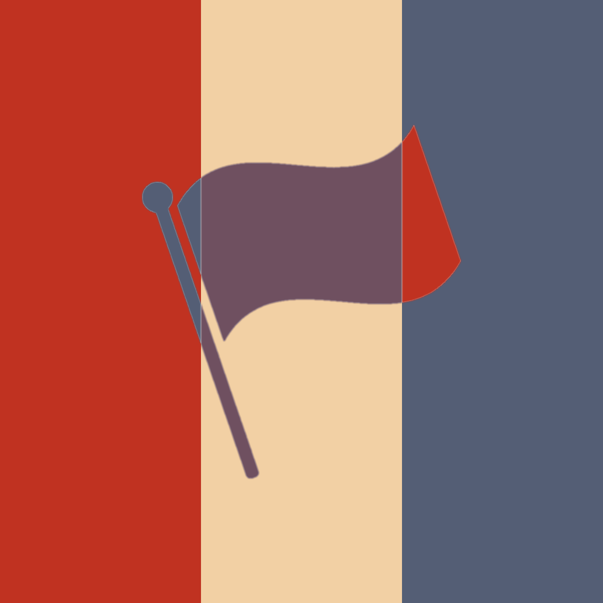

  

<h3 align="center">State Of The Nation</h3>

# Overview
A game made with the Java Swing framework, heavily inspired by the 
(2002-Current) web game [NationStates](https://nationstates.net).

## Features

*Features list to be updated - upon project development*

## Roadmap

- [X] Customisable nation details
- [ ] Custom flag upload
- [ ] Flag ripple effect
- [ ] Pool of country issues to act on
- [ ] Policy section
- [ ] Economy section
- [ ] More to come

## License

Distributed under the MIT license. For more info see `LICENSE.txt`. 
